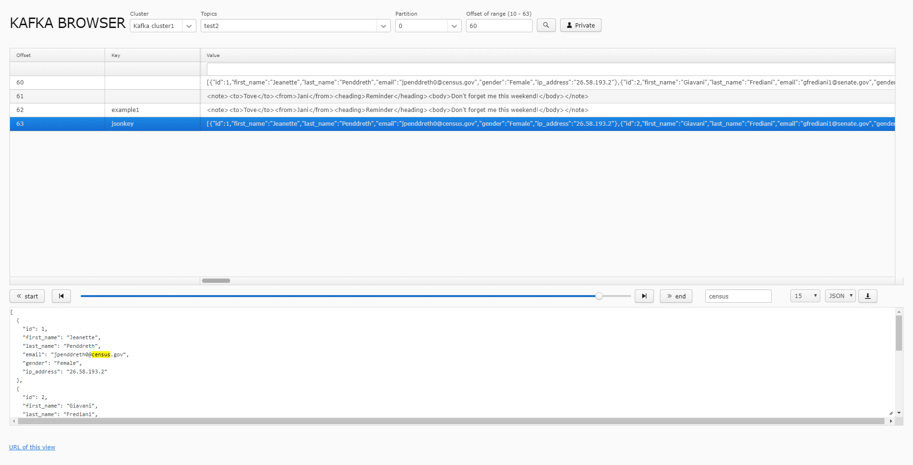

Kafkabrowser 
==============

Simple Vaadin application for browsing Kafka messages



## Features
 - message viewer (plain, pretty JSON and XML, HEX)
 - search message by offset
 - multiple Kafka clusters support
 - filter messages in current view
 - highlight text in message
 - authentication SASL support to browse password protected topics
  

## Usage

1. Edit Kafka clusters \src\main\webapp\appconf.xml
2. Check that your java version is >=1.8: 
```
mvn --version
```
Unless change `java_home`

3. To compile the entire project, run 
```
mvn install
```
4. To run the application
```
mvn jetty:run
```
5. Open in your browser this: http://localhost:8080/
6. If Snappy compression in topics is enabled set exec flag on tmp
```
  mount -o remount,exec /var/tmp/
  mount -o remount,exec /tmp/
```

